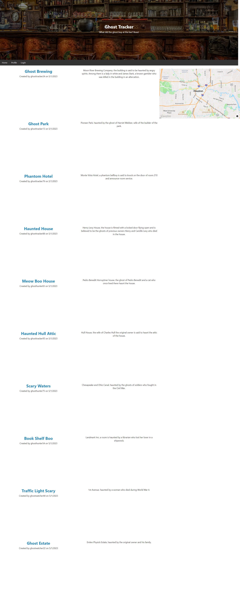

# ghost-tracker-blog

## Description

The purpose of this project was to work collaboratively in a group to build an app implementing Node.js, Express.js, Handlebars.js, MYSQL, and Sequelize ORM. This app uses both GET and POST routes for retrieving and adding new data.

## Usage

To use this app you will need to access it in the browser via the deployed link. Sign up and then log in using your credentials to be able to create a post and view previous user's post on the webpage. Use the map to track ghost sighting locations you want to explore.

## Credits

tgold1
CrowTrooper202
dannydelts94

## License

MIT

## Deployed Link and Screenshot

The heroku link: https://quiet-wave-19391.herokuapp.com/

